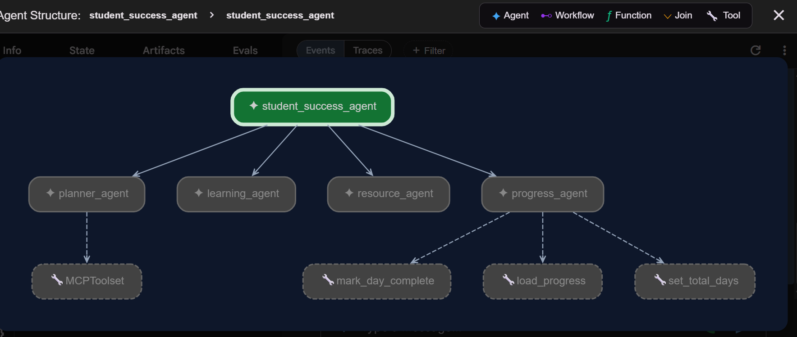

# Student Success Agent 🎓

A multi-agent AI system built with Google ADK that helps students plan, learn, find resources, and track academic progress.

## Problem Statement
Students often struggle with exam preparation — they don't know what to study, how to plan, or where to find resources. This agent solves all of that in one place.

## Why It Matters

Students often waste time deciding what to study instead of actually studying.
This project provides personalized planning, learning assistance, resource recommendations, and progress tracking through a coordinated multi-agent system.

## Solution
A coordinated multi-agent system where each agent specializes in one aspect of student success.

## Agent Architecture

The Student Success Agent uses a multi-agent architecture built with Google ADK.



```
student_success_agent (root)
├── planner_agent
│   └── MCPToolset (saves/loads study plans)
├── learning_agent (explains concepts)
├── resource_agent (recommends resources)
└── progress_agent
    ├── mark_day_complete (tool)
    ├── load_progress (tool)
    └── set_total_days (tool)
```
## Agents

| Agent | Role |
|-------|------|
| Root Agent | Coordinates and delegates to specialized agents |
| Planner Agent | Creates personalized study plans, saves via MCP |
| Learning Agent | Explains concepts and answers academic questions |
| Resource Agent | Recommends books, websites, practice materials |
| Progress Agent | Tracks study progress and motivates students |

## Key Features

- ✅ Multi-agent delegation with Google ADK
- ✅ MCP Server integration (saves/loads study plans as JSON)
- ✅ Progress tracking with completion percentage
- ✅ Input validation and prompt injection protection
- ✅ Persistent data storage in data/ folder

## Tech Stack
- Google ADK 2.3.0
- Gemini 2.0 Flash
- MCP (Model Context Protocol) + FastMCP
- Python 3.13

## Project Structure
student_success_agent/

├── agent.py              # Main entry point with all agents

├── mcp/

│   └── study_plan_server.py  # MCP server for study plan persistence

├── skills/

│   └── progress_tracker.py   # Progress tracking skill

├── security/

│   └── input_validator.py    # Input validation + prompt injection protection

├── data/

│   └── progress.json         # Persistent progress storage

└── README.md
## Setup Instructions

1. Clone the repository
```bash
git clone <your-repo-url>
cd student_success_agent
```

2. Install dependencies
```bash
pip install google-adk mcp fastmcp python-dotenv
```

3. Add your API key to .env

GOOGLE_API_KEY=your_key_here

4. Run the agent
```bash
adk web student_success_agent
```

## Demo Scenario
**User:** "I have a DBMS exam in 7 days and can study 2 hours per day"

**Flow:**
1. Root Agent receives request
2. Delegates to Planner Agent
3. Planner Agent creates 7-day schedule
4. Saves plan via MCP tool to data/
5. Returns structured study plan to student

**User:** "I completed Day 1"

**Flow:**
1. Root Agent delegates to Progress Agent
2. Progress Agent calls mark_day_complete tool
3. Updates progress.json
4. Returns: Completed 1/7 days → 14%

## Security Features
- Input length validation (max 1000 characters)
- Prompt injection detection and blocking
- Off-topic/harmful content filtering

## Kaggle AI Agents Course Concepts

This project demonstrates the core concepts taught in the Kaggle 5-Day AI Agents Course:

- ✅ Multi-Agent Systems using Google ADK
- ✅ Agent Delegation and Routing
- ✅ MCP (Model Context Protocol)
- ✅ Agent Skills
- ✅ Persistent Storage
- ✅ Security and Input Validation
- ✅ Real-World Educational Use Case